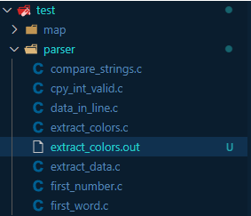
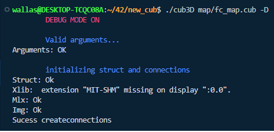
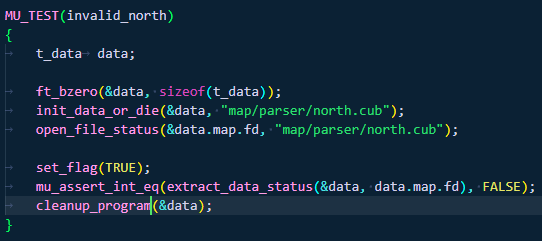

# 🎮 Cub3D

📏
*	This project’s objectives are similar to all this first year’s objectives: Rigor, use of C, use of basic algorithms, information research etc.

*	As a graphic design project, cub3D will enable you to improve your skills in these areas: windows, colors, events, fill shapes, etc. To conclude cub3D is a remarkable playground

*	to explore the playful practical applications of mathematics without having to understand the specifics.

# 📦 Dependencies

MiniLibX for Linux requires, and, therefore you will need to install the following dependencies:
```
sudo apt-get update && sudo apt-get install xorg libxext-dev zlib1g-dev libbsd-dev
```
# ⚙️ Installing

```
git clone git@github.com:Wagratom/42_cub.git  --recurse-submodules
```

* After installing the repository, you can verify whether the "BUFFER SIZE" of the header file in the "libft" library is equal to 1 in order to prevent memory leaks.

# Makefile

* To generate the executable, use the command "make".
```
Make
```


## tests ✅

- To run some validation tests on the map, you can use the command "make tests". This will run all the tests automatically. Some tests may be commented out, so you can check them in the "tests" folder. If you make changes to the code, you can run the "make tests" command again to verify that everything is still working correctly.
```
Make tests
```

- If a failed test is run and the executable file is not deleted, you can automatically delete it so that the code can be re-run. <br> <br> 


## valgrind test

- The Makefile also includes the functionality to run tests with Valgrind to check for potential errors and memory leaks. Simply use the "vg" option before the word "test".
```
Make vgtests
```

## single test

- If you want, you can also run an individual test. You can use the 'test' command and assign the path of the file (without the extension) inside the 'test' folder to the 't' variable. Example:
```
Make test t=parser/extract_data
```

## single test vg

- To run an individual test file with Valgrind, simply use the "vg" option before the test name.
```
Make vgtest t=parser/extract_data
```

Note that some tests may be commented out for better operation.

# MOD DEGUB 🌈

- If you want to activate the debug mode of our project, you can pass the flag "-D" after the executable parameters. <br> <br>

- You can also activate the debug mode in any part of the code using the set_flag(TRUE) function, and the information will start being printed from that point on. The set_flag(TRUE) function also works within the scope of the tests. If you want to receive more information about what is happening in the test, you can activate the function. <br> <br> Note: it is more useful to use it in the "test" folder. <br> <br> 


# 📢 Project Points

<h2>raycast</h2>

*	It uses rays to render a 3D scene on a 2D map. These rays travel through the screen until they hit an object, then the time it took for the ray to hit an object is calculated to determine the size and distance of the object. With these calculations, we can render the object on the screen.

<h2>Flood fill</h2>

*	To check if the map is closed, we use the logic of the Flood Fill algorithm which works as an area filling, where an initial point (player position) is selected and from it the area is expanded, visiting all adjacent positions of the matrix (map) and marking them as "visited". If, after going through all positions in the matrix, and no position is an invalid character, the map is considered closed. Otherwise, it is classified as not closed. <br> <br> If you want to see the algorithm in action, you can uncomment the function in sources/check_exit/check_exit.c.
